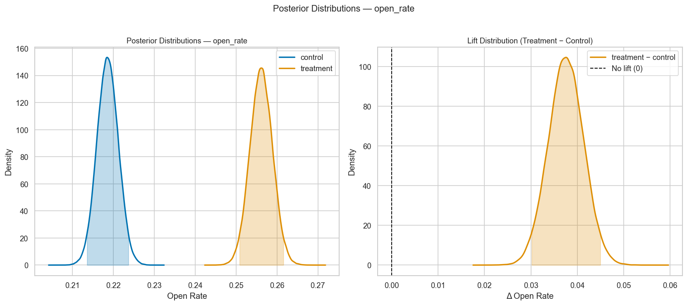
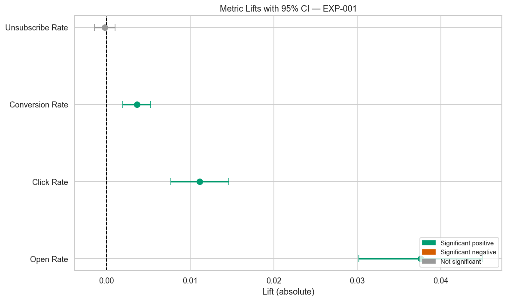
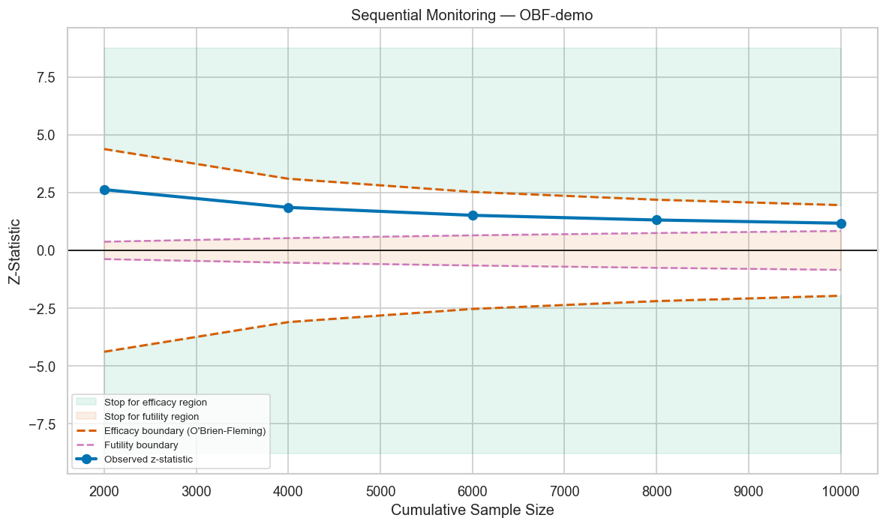
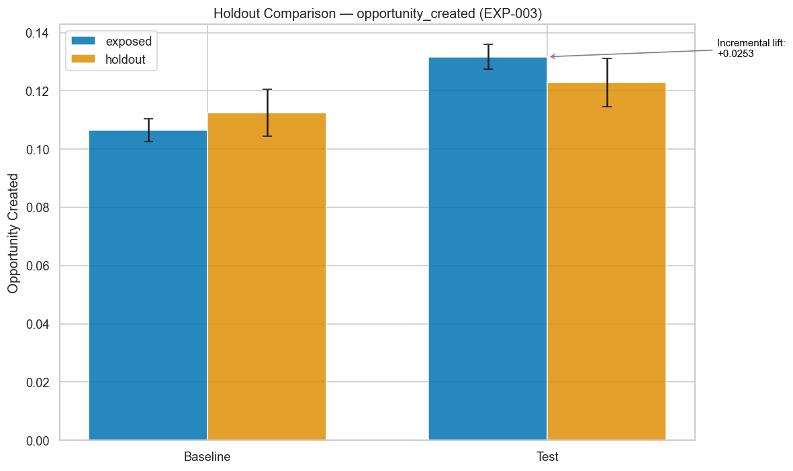
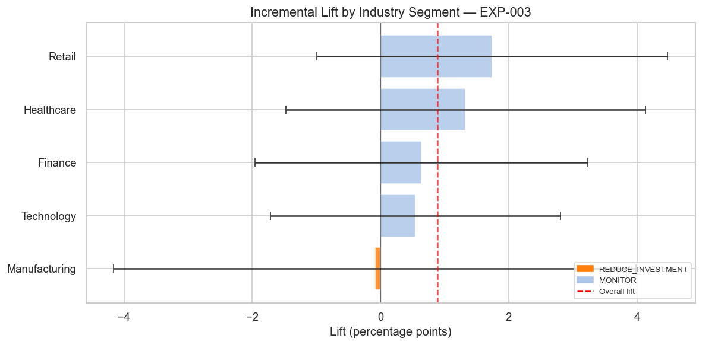
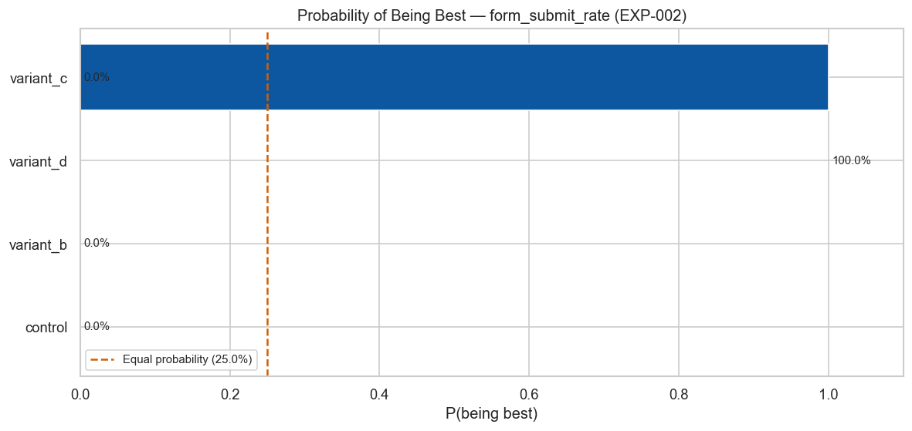

# Campaign Experimentation & Lift Measurement Framework

> Production-grade A/B and multivariate testing framework with Bayesian and frequentist analysis, holdout incrementality measurement, sequential testing, and automated marketing recommendations.


---

## Overview

This framework provides end-to-end infrastructure for running statistically rigorous marketing experiments at scale. It was built to demonstrate the full lifecycle of a campaign experiment: pre-experiment design, randomization, execution, analysis, and translation into concrete business decisions.

The framework implements both **frequentist** and **Bayesian** methodologies side-by-side, enabling practitioners to leverage the strengths of each approach. Frequentist methods provide the familiar p-value and confidence interval framework required by many marketing operations teams. Bayesian methods provide richer decision support — probability that treatment is better, expected loss, and credible intervals that answer the questions marketers actually ask: *"How confident are we this will work?"* and *"What's the risk if we're wrong?"*

This project is the analytical layer built on top of the **CDP Audience Segmentation Pipeline** (Project 1). The high-intent audience segments produced by the CDP pipeline are the inputs to the holdout and A/B experiments here — creating a closed feedback loop where test results refine future segment targeting.

---

## Framework Architecture

```
┌─────────────────────────────────────────────────────────────────┐
│                    EXPERIMENT LIFECYCLE                         │
│                                                                 │
│  Design         Randomize        Execute        Analyze         │
│  ────────        ─────────       ────────       ────────        │
│  Sample size  → Hash-based    → Synthetic    → Frequentist      │
│  Power curves   stratified       campaign       (z-test,        │
│  Duration       assignment       data           t-test,         │
│  estimation     Balance          generation     bootstrap)      │
│                 check                         → Bayesian        │
│                                                (Beta-Binomial,  │
│                                                 PyMC MCMC)      │
│                                                                 │
│  Recommend      Optimize         Monitor        Report          │
│  ──────────     ────────         ────────       ──────          │
│  Plain-English → HTE segment  → Sequential   → Experiment       │
│  decisions      analysis         testing        catalog +       │
│  Guardrail      Budget           O'Brien-        JSON reports   │
│  checks         allocation       Fleming                        │
└─────────────────────────────────────────────────────────────────┘
```

---

## Key Features

- **Dual methodology**: Frequentist (z-test, Welch's t, bootstrap CIs) and Bayesian (Beta-Binomial analytical + PyMC MCMC) with side-by-side comparison
- **5 realistic experiments**: A/B email test, A/B/C/D landing page multivariate, holdout incrementality, channel mix ROI tradeoff, send time optimization
- **Multiple comparison corrections**: Bonferroni, Holm-Bonferroni, Benjamini-Hochberg, Dunnett's — compared side by side with tradeoff discussion
- **Sequential testing**: O'Brien-Fleming boundaries, always-valid confidence intervals, early stopping for efficacy and futility
- **Incrementality measurement**: Difference-in-differences estimator, parallel trends validation, holdout contamination detection
- **Automated recommendations**: Statistical results translated to `SHIP_TREATMENT | EXTEND_TEST | NO_WINNER | BLOCKED_BY_GUARDRAIL` decisions with plain-English rationale
- **Segment optimization**: Heterogeneous treatment effect analysis, Bonferroni-corrected HTE, budget allocation by marginal returns

---

## Quick Start

```bash
git clone https://github.com/yourusername/campaign-experimentation-framework
cd campaign-experimentation-framework
pip install -r requirements.txt

# Generate all 5 synthetic experiments
python -m src.data_generator

# Run frequentist analysis on EXP-001
python -m src.ab_frequentist

# Run Bayesian analysis
python -m src.ab_bayesian

# Full recommendation report
python -m src.recommendation_engine

# Run all tests
pytest tests/ -v

# Launch notebooks
jupyter notebook notebooks/
```

---

## Example: Full Experiment Report

```
==================================================
EXPERIMENT REPORT: Email Subject Line Personalization (EXP-001)
==================================================

VERDICT: SHIP TREATMENT

PRIMARY METRIC (open_rate):
  Control: 21.9%  |  Treatment: 25.6%
  Absolute Lift: +3.7pp  |  Relative Lift: +16.9%
  p-value: < 0.0001  |  Significant: Yes
  95% CI: (3.1pp, 4.3pp)

SECONDARY METRICS:
  click_rate:        +1.3pp lift (p<0.0001)  -- Significant
  conversion_rate:   +0.3pp lift (p=0.002)   -- Significant

GUARDRAILS:
  unsubscribe_rate:  +0.01pp (p=0.82)  -- No degradation
  spam_complaint_rate: 0.00pp (p=0.95) -- No degradation

RECOMMENDATION:
  Ship personalized subject lines across all segments.
  Estimated impact: +4,600 incremental opens per 100k sends per month.

NEXT STEPS:
  1. Ship treatment to production
  2. Monitor unsubscribe rate for first 14 days post-launch
  3. Run follow-up test for SMB Retail (weaker lift subgroup)
==================================================
```

---

## Experiment Catalog

| ID | Name | Type | N | Primary Metric | Key Result |
|----|------|------|---|----------------|------------|
| EXP-001 | Email Subject Line Personalization | A/B | 50,000 | open_rate | +3.7pp lift, SHIP |
| EXP-002 | Landing Page Multivariate Test | A/B/C/D | 80,000 | form_submit_rate | Variant C wins (+3pp), B null (as designed) |
| EXP-003 | High-Intent Segment Holdout | Holdout | 30,000 | opportunity_created | ~15% incremental lift via DID |
| EXP-004 | Channel Mix Test | A/B | 40,000 | mql_conversion_rate | Treatment wins on rate, ROI tradeoff on cost |
| EXP-005 | Send Time Optimization | A/B/C | 60,000 | open_rate | Afternoon best opens, morning best clicks |

---

## Methodology Deep Dive

### Frequentist vs. Bayesian: When to Use Each

| Dimension | Frequentist | Bayesian |
|-----------|-------------|---------|
| Primary question | "Is this effect real?" | "How likely is treatment to be better?" |
| Output | p-value, CI | P(B>A), HDI, expected loss |
| Stopping rule | Must be pre-specified | Natural via expected loss |
| Sample size | Required pre-experiment | Optional (posterior gets sharper) |
| Best for | Compliance-sensitive decisions, reproducibility | Business decisions needing probability statements |

**In this framework**: both are computed for every experiment. Use frequentist p-values to satisfy audit requirements, Bayesian P(B>A) for internal go/no-go decisions.

### The Multiple Testing Problem

When comparing 4 variants pairwise (6 comparisons), the family-wise error rate with no correction reaches 26.5%. The Bonferroni correction controls this to 5% but is conservative. Holm-Bonferroni improves power while maintaining FWER control. Benjamini-Hochberg (FDR) is appropriate when the cost of false positives is low and you need more discoveries. See Notebook 3 for a full side-by-side comparison.

### Sequential Analysis and the Peeking Problem

Checking an ongoing experiment repeatedly at nominal alpha=0.05 inflates the true false positive rate to ~19% after 5 looks. The O'Brien-Fleming spending function solves this by spending alpha conservatively early (wide boundaries) and using the full alpha at the final analysis. See Notebook 5 for simulation of both early-stop scenarios.

### Incrementality via Holdout Groups

Raw conversion rate differences between exposed and control can be confounded by selection effects (exposed accounts may already be higher-intent). The Difference-in-Differences estimator removes this bias:

```
DID = (Exposed_post - Exposed_pre) - (Holdout_post - Holdout_pre)
```

Validity requires parallel trends in the pre-period — tested via OLS interaction F-test in `holdout_analysis.py`.

---

## Connection to Project 1: CDP Audience Segmentation Pipeline

This framework is the downstream analytical complement to the CDP Audience Segmentation Pipeline. The relationship:

```
CDP Pipeline (Project 1)                  Experimentation Framework (Project 2)
───────────────────────────               ──────────────────────────────────────
Audience scoring → High/Med/Low intent    engagement_tier in HTE analysis
Segment IDs                            →  Randomization inputs for holdout
Propensity scores                      →  Covariate adjustment in DID
Feature store                          →  Stratification in balance checks
```

**The workflow in practice**: The CDP pipeline scores 30,000 accounts as High-Intent. The experiment designer randomizes 80% to campaign exposure, 20% to holdout. After 60 days, the HTE analysis reveals Enterprise Technology accounts show 2× the average lift. The CDP pipeline is re-run to identify which Enterprise Technology accounts most resemble the high-responders — tightening the next campaign's targeting.

---

## Results Gallery

### Posterior Distributions (Bayesian A/B)
The overlapping Beta posteriors for open rate control and treatment, with 95% HDI shaded and the difference distribution showing P(treatment > control).



### Lift Forest Plot (Multi-Metric)
Forest plot showing absolute lift with 95% CIs for all metrics, color-coded by significance.



### Sequential Monitoring
O'Brien-Fleming efficacy and futility boundaries with the test statistic trajectory over the experiment.



### Holdout Comparison
Pre/post metric comparison for exposed vs holdout groups, with baseline period, test period, and incremental lift annotation.



### Segment Lift
Horizontal bar chart of per-segment incremental lift with CIs, color-coded by recommendation tier.



### P(Being Best) — Multivariate
Bayesian probability of being the best variant for the A/B/C/D landing page test.



---

## Project Structure

```
campaign-experimentation-framework/
│
├── README.md
├── requirements.txt
├── config.py                          # All thresholds and defaults
│
├── data/                              # Generated at runtime
│   ├── exp001_email_subject_line.csv  # 50,750 rows
│   ├── exp002_landing_page_mvt.csv    # 80,000 rows
│   ├── exp003_holdout.csv             # 60,000 rows (panel)
│   ├── exp004_channel_mix.csv         # 40,000 rows
│   └── exp005_send_time.csv           # 60,000 rows
│
├── src/
│   ├── data_generator.py              # Synthetic experiment data
│   ├── experiment_designer.py         # Sample size, power, randomization
│   ├── ab_frequentist.py              # z-test, t-test, bootstrap CIs
│   ├── ab_bayesian.py                 # Beta-Binomial + PyMC MCMC
│   ├── multivariate_test.py           # A/B/n with 4 MCC methods
│   ├── holdout_analysis.py            # DID, contamination, balance
│   ├── sequential_testing.py          # OBF boundaries, always-valid CIs
│   ├── segment_optimization.py        # HTE, budget allocation
│   ├── recommendation_engine.py       # Statistical → business decisions
│   └── visualizations.py             # All 9 plot types
│
├── notebooks/
│   ├── 01_experiment_design.ipynb     # Power analysis, randomization
│   ├── 02_ab_test_analysis.ipynb      # Frequentist + Bayesian side-by-side
│   ├── 03_multivariate_test.ipynb     # 4 corrections, P(best)
│   ├── 04_holdout_incrementality.ipynb # DID, balance, cost efficiency
│   ├── 05_sequential_testing.ipynb    # OBF, peeking problem
│   └── 06_segment_optimization.ipynb  # HTE, budget allocation
│
├── experiments/
│   └── experiment_catalog.json        # Registry of all 5 experiments
│
├── tests/
│   ├── test_power_analysis.py         # 11 tests
│   ├── test_frequentist.py            # 11 tests
│   ├── test_bayesian.py               # 11 tests
│   ├── test_multivariate.py           # 11 tests
│   └── test_recommendations.py        # 11 tests
│
└── visuals/                           # Generated by notebooks
```

---

## Test Coverage

```
55 tests in 48.6 seconds — all passing

tests/test_power_analysis.py    11 passed
tests/test_frequentist.py       11 passed
tests/test_bayesian.py          11 passed
tests/test_multivariate.py      11 passed
tests/test_recommendations.py   11 passed
```

Key statistical correctness tests:
- Sample size formulas verified against known analytical solutions (±5%)
- p-values verified uniform under the null (empirical type I error rate 2%–10%)
- 95% CI empirical coverage ≥ 90% (200-simulation check)
- Power detection rate ≥ 70% at MDE with required n
- P(B>A) ≈ 0.5 under null (balanced arms, equal rates)
- FWER controlled at ≤ α + tolerance under Bonferroni

---

## License

MIT
